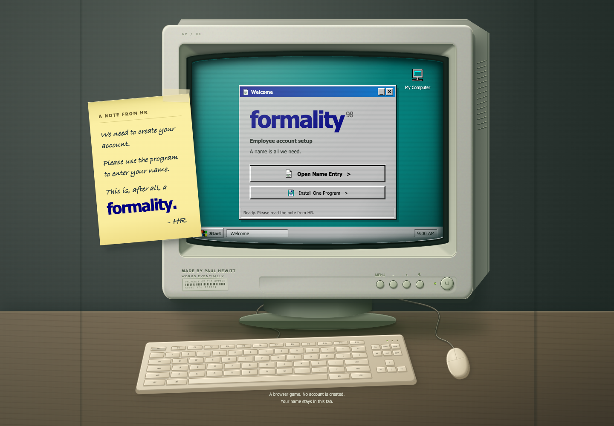
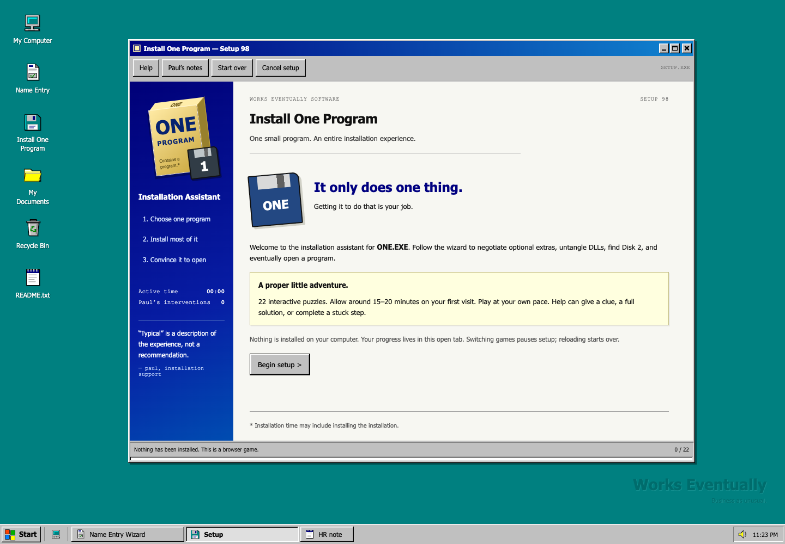
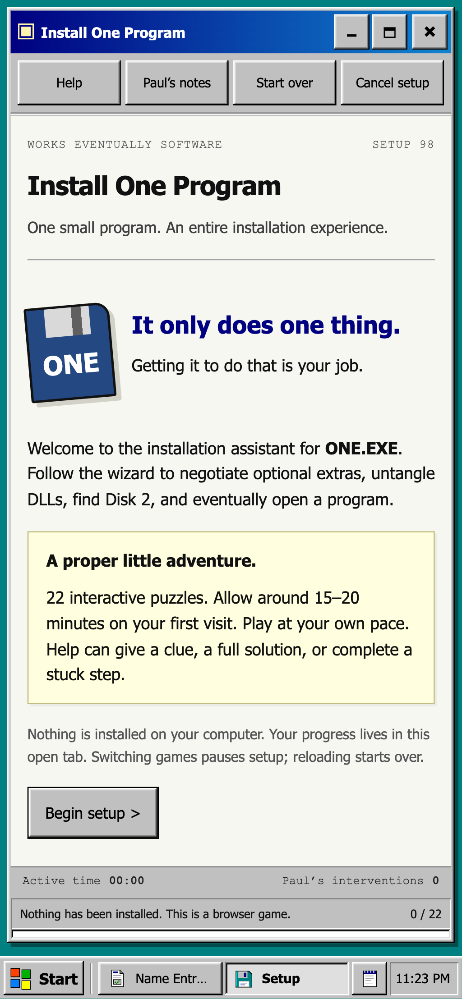

# Works Eventually

**Enter your name. Install a program. Apparently that's asking a lot.**

Two browser games about trying to get one thing done on an old computer. Made by [Paul Hewitt](https://impaulhewitt.com).

[**Play Works Eventually →**](https://workseventually.com/) · [Open FORMALITY](https://workseventually.com/#formality) · [Open Install One Program](https://workseventually.com/#installer)

## The idea

Take all the little things that made old software annoying and turn them into a game. Forms that reject your name. Installers that need another disk. A printer getting involved in something that really shouldn't need a printer.

You start at a chunky CRT monitor. Open a game and the screen expands into a Windows 98-style desktop, with windows, shortcuts, a Start menu, and a taskbar. Then you can get on with the very simple task you came here to do.

## The games

**FORMALITY:** Enter your name. That's the whole job. Somehow it takes 18 scenes and a support ticket.

**Install One Program:** You want one program. The installer has other plans. Sort out DLLs, match adapters, move files around, and find Disk 2. After 22 puzzles, you can finally open a blank document.

## Under the hood

Built with **Astro, TypeScript, and CSS**. Hosted on **Vercel**.

- Each game keeps its own progress and pauses when you switch away. Refreshing the page starts over.
- Keyboard and touch controls, plus a Help button for when you've had enough.
- Reduced-motion support skips the screen zoom.
- Red outlines show which fields need fixing. You shouldn't have to guess where the computer wants to argue next.

Tested in Chrome with full playthroughs, keyboard and touch input, and mobile emulation.

## The code

Just screenshots and project details here. I'm keeping the source private. The games are public, so you can still experience the paperwork.

[Play the games](https://workseventually.com/) · [More from Paul Hewitt](https://impaulhewitt.com)
